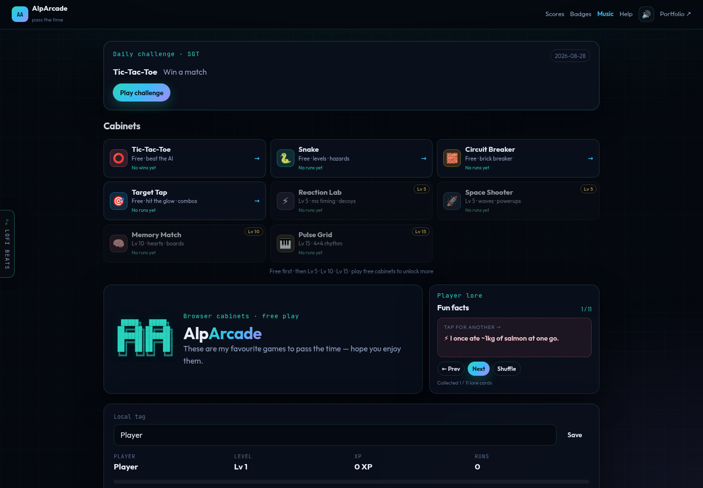

# AlpArcade

Browser mini-games with a local scoreboard (and an optional global one). No account needed to play.

**[Play AlpArcade](https://alphaeusng.github.io/AlpArcade/)** · [Portfolio](https://alphaeusng.github.io/)

The live site *is* the demo. Open it, click a cabinet, play.

## What you get

Cabinets on the lobby (free first, then Lv 5 / 10 / 15 unlocks):

| Cabinet | What it is |
| --- | --- |
| Tic-Tac-Toe | Beat the AI |
| Snake | Levels and hazards |
| Circuit Breaker | Brick breaker |
| Target Tap | Hit the glow, combos |
| Reaction Lab | Millisecond timing, decoys |
| Space Shooter | Waves and powerups |
| Memory Match | Hearts and boards |
| Pulse Grid | 4x4 rhythm |

Daily challenge is one seeded target per **Singapore (SGT)** day. Badges, a local player tag, and personal bests stay on this device. Optional Google sign-in posts one best per game to the cloud board.

## Try it

1. Open **[the live arcade](https://alphaeusng.github.io/AlpArcade/)**.
2. Click **Tic-Tac-Toe** (free) and play a round against the AI.
3. Press **Esc** to return to the lobby. **P** pauses Snake and Space Shooter.
4. Open **Scores** to see local XP and bests. Export/import a code if you want to move them. **Save with Google** only if you want the optional global board.

More controls: Snake/Shooter use WASD or arrows. Reaction Lab: wait for green, then tap. Pulse Grid: keys `1–4`, `QWER`, `ASDF`, `ZXCV` when the shutter closes.

Working in this repo? See **[AGENTS.md](AGENTS.md)** for layout, tests, Firebase, and deploy rules.
